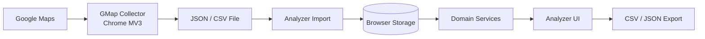

# Architecture - GMap Prospect Analyzer

## 1. Architectural Goals

- Local-first dan dapat berjalan sebagai static web app.
- Collector dan Analyzer memiliki boundary yang jelas.
- Logic domain dapat diuji tanpa browser UI.
- Scoring dan schema dapat berkembang tanpa rewrite komponen interface.
- MVP cukup realistis untuk satu developer.

## 2. System Context



## 3. Components

### 3.1 GMap Collector

Collector berjalan sebagai Chrome Extension Manifest V3.

```text
collector/
  content/
    maps-extractor
    collection-controller
  domain/
    normalizer
    deduplicator
  export/
    json-exporter
    csv-exporter
  popup/
    progress-view
    result-summary
```

Tanggung jawab:

- Membaca result card yang tersedia pada halaman Google Maps.
- Mengubah data mentah menjadi `BusinessRecord`.
- Menghasilkan `businessId` deterministik.
- Mencegah duplicate dalam satu collection.
- Mengirim progress dan partial errors ke popup.
- Menghasilkan JSON envelope atau flat CSV.

Collector tidak menyimpan analytics, tidak menghitung recommendation, dan tidak membutuhkan backend.

### 3.2 GMap Analyzer

```text
analyzer/
  app/
    router
    app-state
  domain/
    schema
    normalization
    deduplication
    scoring
    recommendation
    analytics
    filtering
  persistence/
    dataset-repository
    browser-storage-adapter
  import-export/
    json-importer
    csv-importer
    csv-exporter
  ui/
    overview
    prospects
    datasets
    analytics
    settings
    shared-table
```

Tanggung jawab Analyzer:

- Validasi dan import JSON/CSV.
- Menyimpan dataset lokal.
- Merge dan deduplicate dataset.
- Menyediakan query search, filter, dan sort.
- Menjalankan scoring pada domain service.
- Menghasilkan recommendation dan analytics dari dataset aktif.
- Menyediakan action untuk detail dan export.

## 4. Data Flow

### Collection

1. User membuka hasil Google Maps.
2. Content script mendeteksi result card yang tersedia.
3. Extractor membaca field yang dikenal.
4. Normalizer membersihkan teks dan mengubah numeric field.
5. Deduplicator menggunakan `businessId`.
6. Controller mengirim progress ke popup.
7. Exporter membangun JSON atau CSV sesuai `DATA-SCHEMA.md`.

### Import

1. User memilih file.
2. Importer mendeteksi JSON atau CSV.
3. Parser memvalidasi envelope, version, required fields, dan tipe.
4. Normalizer mengubah data legacy atau variasi format ke canonical record.
5. Repository melakukan merge atau membuat dataset baru.
6. Analyzer menghitung score saat query atau setelah import.
7. UI memperbarui overview, table, analytics, dan recommendation.

### Analysis

```text
Canonical Dataset
  -> Filter and Search
  -> Score Each Business
  -> Aggregate Analytics
  -> Rank Recommendation
  -> Render UI / Export
```

## 5. Module Boundaries

| Module | Input | Output | Tidak boleh dilakukan |
|---|---|---|---|
| Extractor | Google Maps DOM | raw partial fields | scoring, persistence |
| Normalizer | raw fields | canonical `BusinessRecord` | membuat data yang tidak tersedia |
| Deduplicator | records | unique records | menghapus record tanpa identity strategy |
| Repository | datasets | persisted datasets | bergantung pada komponen React |
| Scoring | business + config | score, label, reasons | akses DOM atau storage |
| Recommendation | scored records | ordered prospects | membuat alasan baru di luar scoring |
| Analytics | dataset + scored records | aggregate metrics | mengarang geo insight |
| UI | view models | user interaction | menduplikasi domain rules |

## 6. Storage Strategy

Gunakan interface repository agar storage dapat diganti:

```text
DatasetRepository
  - listDatasets()
  - getDataset(datasetId)
  - saveDataset(dataset)
  - deleteDataset(datasetId)
  - mergeDataset(datasetId, records)
```

Adapter MVP menggunakan IndexedDB untuk dataset berukuran lebih besar. localStorage dapat dipakai untuk settings kecil seperti target category dan scoring config. Tidak ada network persistence.

Jika storage gagal, UI harus menampilkan error yang dapat ditindaklanjuti dan tidak menghapus data yang sudah ada.

## 7. Scoring, Recommendation, Analytics

- Scoring menerima canonical record dan `ScoringConfig`, lalu mengembalikan `PotentialResult`.
- Recommendation hanya mengurutkan hasil scoring dan meneruskan reasons.
- Analytics menghitung agregat dari dataset aktif dan hasil scoring.
- Ketiga service tidak boleh mengimpor komponen UI.
- Detail algoritma berada di `SCORING.md`.

## 8. Import and Export Boundary

JSON adalah format pertukaran lengkap dengan metadata dan schema version. CSV adalah format flat untuk spreadsheet dan CRM future, tetapi tetap berisi field canonical yang ditentukan schema.

Analyzer harus menerima file dari Collector dan export Analyzer harus dapat dibaca ulang oleh Analyzer.

## 9. Deployment

- Build menghasilkan asset static.
- Deploy target adalah GitHub Pages.
- Konfigurasi build harus menggunakan base path repository.
- Tidak ada secret runtime dan tidak ada server-side environment requirement.
- CI minimal menjalankan typecheck, lint, test, dan build.

## 10. Reliability and Privacy

- DOM Google Maps dapat berubah; extractor harus gagal secara parsial, bukan membuat seluruh collection crash.
- Field optional boleh hilang atau bernilai `null`.
- Progress harus membedakan processed, collected, duplicate, dan failed.
- Data bisnis yang dikumpulkan dibatasi pada kebutuhan prospecting MVP.
- Implementasi harus mematuhi terms dan batasan platform yang berlaku; jangan mengimplementasikan bypass pembatasan.

## 11. Future Extension Points

Future backend dapat diperkenalkan melalui implementation baru untuk `DatasetRepository`, tanpa mengubah scoring, schema domain, dan UI contract. Authentication, cloud sync, CRM, AI, dan automation tetap berada di luar MVP serta memerlukan requirement terpisah.

## 12. Traceability

| Requirement group | Owning modules |
|---|---|
| Collector and export | extractor, normalizer, deduplicator, export |
| Dataset management | import-export, repository, dataset UI |
| Prospect table | filtering, shared-table, prospects UI |
| Potential | scoring service, settings UI |
| Recommendation | recommendation service, overview UI |
| Analytics | analytics service, analytics UI |
| Static deployment | build configuration, CI, GitHub Pages |
